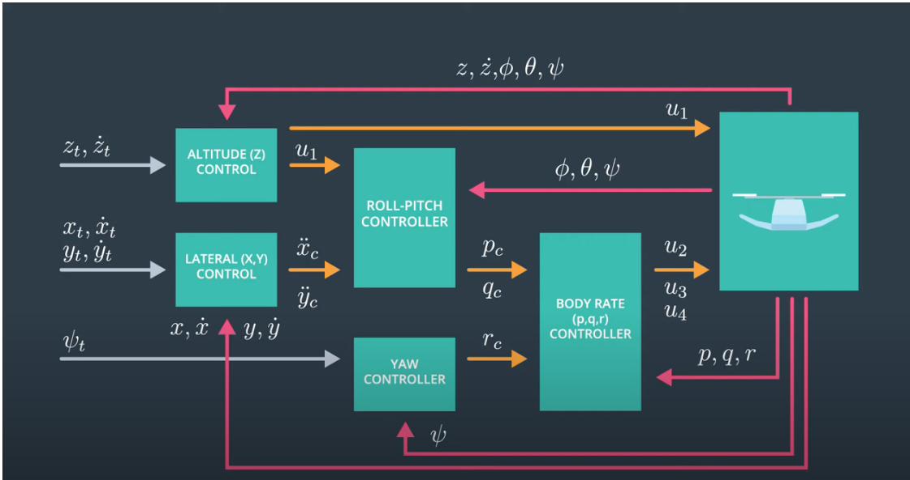
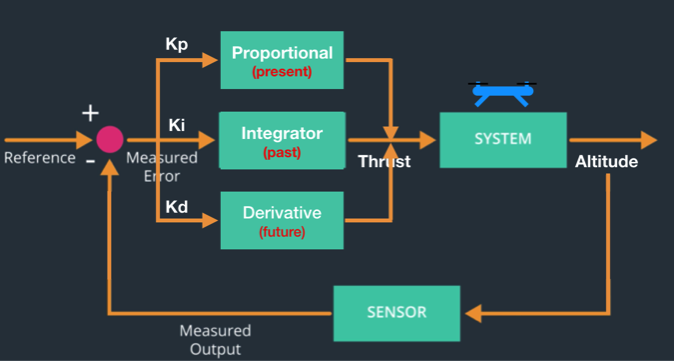
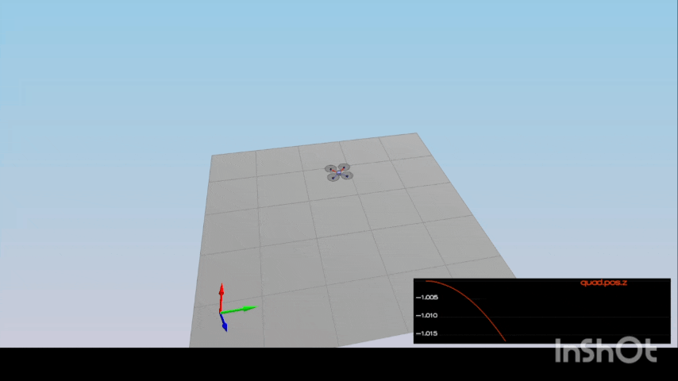
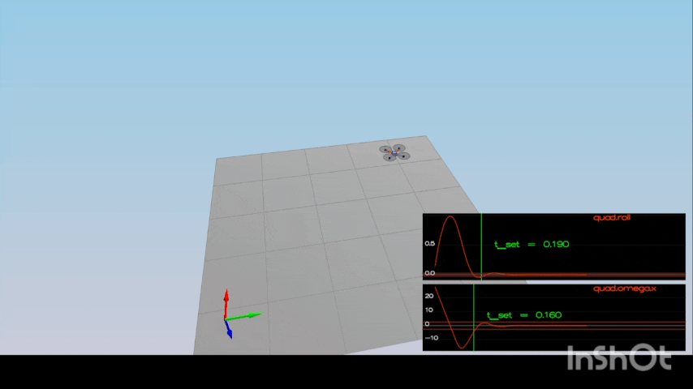
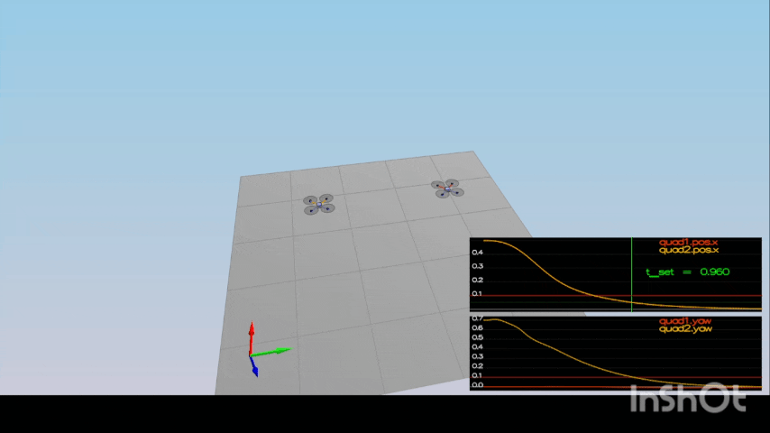
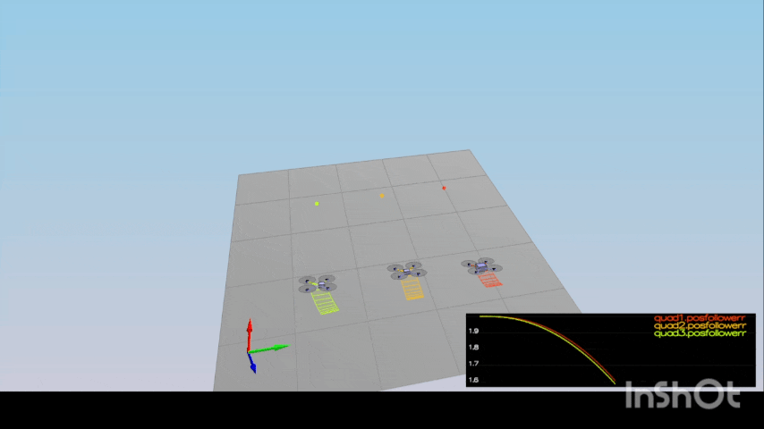

## My Implementation Summary

This repository contains my completed implementation of the **FCND Controls C++ project**.

**What I implemented and validated:**
- Implemented and tuned PID-based controllers for altitude, attitude, position, and trajectory tracking
- Adjusted control gains to satisfy all provided simulation scenarios
- Built and tested the project locally using CMake on Windows 10 using Visual Studio
- Verified controller behavior through multiple flight scenarios (hover, position hold, trajectory follow)

This project is included here as part of a broader **UAV Flight Controls Portfolio**, which also demonstrates real-hardware experiments on a Crazyflie 2.0 quadcopter.

## What I implemented and why

This controller is organized as a cascade:

1. **Trajectory tracking**
   - The simulator provides desired position, velocity, acceleration, and yaw.

2. **Outer loops**
   - `AltitudeControl()` computes collective thrust from vertical position/velocity error plus feed-forward acceleration.
   - `LateralPositionControl()` computes desired XY acceleration from position and velocity error.

3. **Attitude / rate loops**
   - `RollPitchControl()` converts desired lateral acceleration into body-rate commands by aligning the thrust vector.
   - `YawControl()` computes the desired yaw rate using wrapped yaw error.
   - `BodyRateControl()` converts desired body rates into moments using the vehicle inertia.

4. **Motor mixing**
   - `GenerateMotorCommands()` maps collective thrust and body moments into four rotor thrust commands.

I used saturation at each layer to keep commands physically achievable and improve robustness across all test scenarios.

## Design choices I made

- Used **integral control only in altitude** to remove steady-state vertical bias.
- Saturated **XY velocity before acceleration** so the cascade stays well behaved.
- Limited commanded tilt using `sin(maxTiltAngle)` because lateral acceleration is applied through the body-z direction.
- Wrapped yaw error to `[-pi, pi]` so the vehicle always takes the shortest rotation.

## Control Architecture
The quadrotor control system follows a cascaded architecture with multiple control loops operating at different levels:

- **Position (X,Y,Z) control** generates desired accelerations and thrust
- **Attitude control (roll, pitch, yaw)** converts acceleration commands into orientation setpoints
- **Body-rate control (p,q,r)** generates motor commands
- Inner loops run at higher rates to ensure stability and fast disturbance rejection




## PID Control Design
Each control loop uses a PID controller:

- **Proportional (P):** primary response to error
- **Integral (I):** compensates steady-state errors
- **Derivative (D):** improves damping and transient response

Gains were tuned iteratively to satisfy stability and performance requirements across all scenarios.




## Simulation Scenarios and Results

This project was evaluated using the official quadrotor simulator and a set of standardized scenarios provided by the Udacity FCND Controls C++ project. Each scenario tests a specific set of controller capabilities including stabilization, position/attitude control, robustness to non-idealities, and trajectory tracking. :contentReference[oaicite:1]{index=1}

### Scenario 1 – Intro / Initial Setup
### What it tests : Vehicle initialization and hover behavior
In this scenario the quadrotor starts above the origin with default parameters and falls due to gravity. The goal of this stage is to initialize the controller and tune the vehicle mass and basic thrust distribution so that the system does not simply fall. This step ensures that the baseline controller produces hover when expected.

### Objective:
Verify that the quadrotor can remain stable and hover without diverging.

### Implementation:
No new controller logic was required for this scenario. This scenario was used to confirm:
1. Correct motor mixing
2. Proper thrust direction
3. Correct sign conventions
   
### Code Location
•	GenerateMotorCommands()
Converts collective thrust and body moments into individual motor thrusts using quad geometry.
### Result
The quad remained stable and did not diverge, confirming the correctness of the motor command mapping.

▶️ [Watch video](media/scenario1_hover.mp4)



---

### Scenario 2 – Body Rate & Attitude Stabilization
### What it tests : Stabilization of angular rates and attitude 
This scenario requires implementation of body rate control and roll/pitch control. The vehicle begins with an initial rotation and the controller must stabilize the quadrotor’s attitude. Success is measured by rejecting rotation and leveling the vehicle in a timely manner. 
### Objective
Stabilize angular rates and bring the vehicle back to level attitude when initialized with a nonzero roll rate.
### Implementation
### Body Rate Control
Implemented a proportional body-rate controller that computes desired moments from rate error and moments of inertia.
Code:
1.	Function: BodyRateControl()
2.	Location: QuadControl.cpp
#### Key logic:
  ```// Rate error
  V3F rateError = pqrCmd - pqr
  // Element-wise proportional term
  V3F uBar = kpPQR * rateError;   // kpPQR is a V3F (Kp_p, Kp_q, Kp_r)
  // Convert desired angular accelerations to moments using moments of inertia
  momentCmd.x = Ixx * uBar.x;
  momentCmd.y = Iyy * uBar.y;
  momentCmd.z = Izz * uBar.z;
```

### Roll/Pitch Control
Implemented a controller that converts desired lateral acceleration into desired roll and pitch rates using the rotation matrix.
Code:
•	Function: RollPitchControl()
Tuning
1. kpPQR = [52, 52, 5]
2. kpBank = 14

### Result
1. Roll rate converged to zero
2. Vehicle stabilized without excessive overshoot

Simulation below shows the quadrotor initialized with a nonzero roll rate.  
The body rate controller drives the roll rate to zero and stabilizes the attitude.

▶️ [Watch video](media/scenario2_attitude.mp4)



---

### Scenario 3 – Position, Velocity & Yaw Control
### What it tests : Outer loops controlling position and yaw
Once the attitude is stable, this stage tests position and velocity control as well as yaw control. This scenario spawns two quads with different initial conditions and command setpoints; the controller must bring both to their targets and align yaw appropriately. 

### Objective
Move two quadrotors to target positions with different yaw initial conditions.
### Implementation
### Lateral Position Control
Implemented a PD controller on position and velocity, including velocity and acceleration limits.
Code:
1. Function: LateralPositionControl()
   
#### Key logic:
```// Position error
  V3F posErr = posCmd - pos;
  // Velocity error
  V3F velErr = velCmd2 - vel;
// Acceleration command (add to feed-forward)
  accelCmd += kpVelXY * velErr;
```

### Altitude Control
Implemented a vertical PD + integral controller with feedforward acceleration.
Code:
1. Function: AltitudeControl()

Key logic:
```// Integrate altitude error
  integratedAltitudeError += zErr * dt;
// Desired vertical acceleration in NED
  float u1Bar = kpPosZ * zErr + kpVelZ * zDotErr + KiPosZ * integratedAltitudeError + accelZCmd;
// Thrust must counter gravity: accel down positive in NED, so (g - u1Bar)
  float thrust = mass * (static_cast<float>(CONST_GRAVITY) - u1Bar)
      / fmaxf(R(2, 2), 1e-3f);
```

### Yaw Control
Implemented proportional yaw control with angle wrapping.
Code:
1. Function: YawControl()
Tuning
1. kpPosXY = 2.2
2. kpVelXY = 9
3. kpYaw = 1.6
### Result
Both quadrotors converged to their target positions. The yaw-controlled quad aligned correctly without destabilizing position tracking. Quadrotors tracked yaw commands, validating position, velocity, and yaw control.

▶️ [Watch video](media/scenario3_position.mp4)



---

### Scenario 4 – Non-idealities & Robustness
### What it tests : Robustness (multiple vehicles with differing dynamics)
This scenario contains multiple vehicles with different mass and center-of-mass configurations. The controller must robustly handle these non-idealities using the same tuned gains so that all vehicles reach their targets with similar performance.

### Objective
Ensure the controller works under non-ideal conditions:
1. Shifted center of mass
2. Increased vehicle mass
### Implementation
Integral Altitude Control
Added integral action in altitude control to compensate for steady-state errors due to mass mismatch.
Code:
•	AltitudeControl()
•	Integral term: integratedAltitudeError
To improve robustness, lateral aggressiveness was reduced by limiting speed, acceleration, and tilt.
Key Design Decisions
•	Relaxed lateral limits to prevent saturation
•	Increased altitude position gain to compensate for thrust loss during tilt
•	Maintained damping to avoid oscillations
Final Tuning (Scenario 4)
1. kpPosZ = 39
2. KiPosZ = 20
3. kpVelZ = 14
4. maxSpeedXY = 3
5. maxHorizAccel = 8
6. maxTiltAngle = 0.42

### Result
All three quadrotors successfully followed the commanded motion despite non-ideal dynamics.

▶️ [Watch video](media/scenario4_non-idealities.mp4)



## Building and Running

The project was built and tested locally using CMake.

Typical build steps:

```bash
mkdir build
cd build
cmake ..
make
```

After building, the controller is run together with the provided quadrotor simulator to evaluate performance across the required scenarios.

## Conclusion
A full cascaded quadrotor controller was successfully implemented and tuned in C++. Each control layer was validated incrementally through targeted simulation scenarios. The final controller demonstrates stable hover, precise attitude control, accurate position tracking, robustness to non-idealities, and successful trajectory following.

## Author
**Vasan Iyer**  
Embedded Software Development / Flight Controls Engineer  
Focus: Flight Dynamics, Flight controls, navigation, PID control, UAV systems,  Embedded Software development, C++, Python,  sensor fusion, simulation-based verification.

GitHub: https://github.com/Vaiy108

